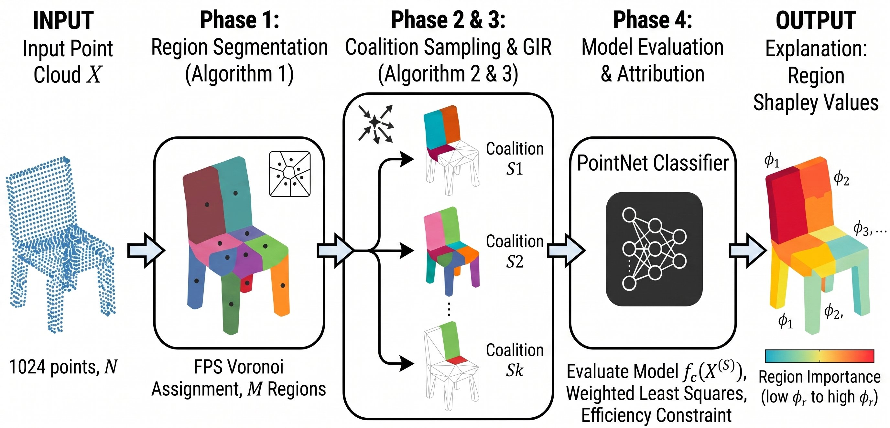
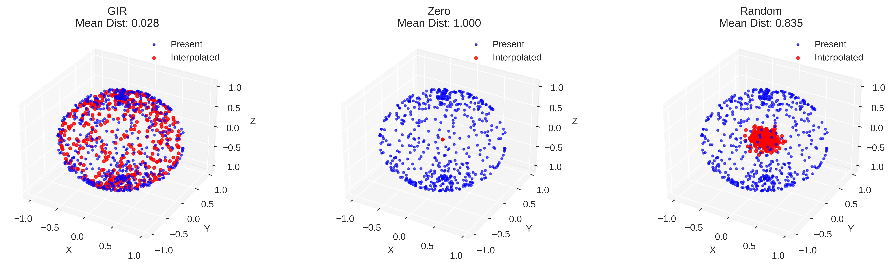
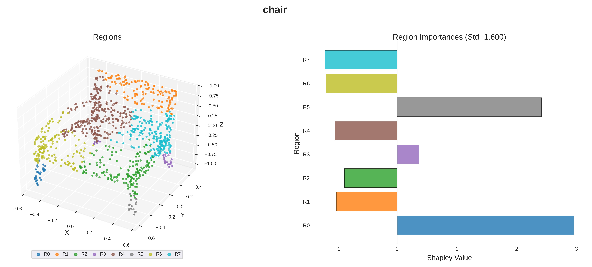
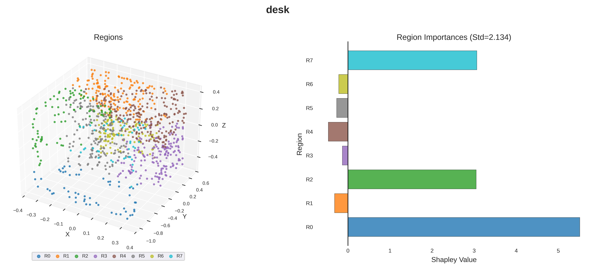

# R-SHAP: Region Based SHAP for 3D Point Cloud Explainability

A principled framework for explaining 3D point cloud classification decisions through Shapley value attribution at the region level.



## Overview

R-SHAP partitions a 3D point cloud into spatially coherent regions using FPS + Voronoi segmentation, then computes Shapley values to quantify each region's contribution to the classification decision. The framework addresses key challenges in point cloud explainability: computational tractability (operating on M regions instead of N points), semantic coherence (regions instead of individual points), and distribution shift (via Geometric Interpolation Reference).

## Key Features

- **Shapley axiom compliance** — satisfies efficiency, symmetry, null player, and linearity
- **Geometric Interpolation Reference (GIR)** — preserves manifold proximity during perturbation (mean distance 0.028 vs 1.000 for zero replacement on unit sphere)
- **Rotation equivariance** — guaranteed when model, reference mechanism, and clustering are all equivariant
- **Logit-space evaluation** — avoids softmax saturation for stronger attribution signal
- **FPS + Voronoi clustering** — deterministic, balanced, spatially coherent, rotation-equivariant

## Pipeline

The R-SHAP pipeline consists of four phases:

1. **Region Segmentation** — FPS + Voronoi partitions the point cloud into M regions (default M=8)
2. **Coalition Sampling & GIR** — K coalitions are sampled with Shapley kernel weights; absent regions are replaced using GIR interpolation
3. **Model Evaluation** — the classifier is evaluated on each perturbed point cloud in logit space
4. **Attribution** — Kernel SHAP regression with efficiency constraint yields region Shapley values

## Results

### GIR Manifold Preservation

GIR interpolation keeps perturbed points close to the original manifold, unlike zero replacement or random noise.



| Method | Mean Distance | Max Distance |
|--------|--------------|--------------|
| **GIR (ours)** | **0.028** | **0.078** |
| Zero | 1.000 | 1.000 |
| Random | 0.835 | 0.969 |

### Qualitative Explanations

R-SHAP produces differentiated region importances that identify which parts of an object contribute most to classification.

<p align="center">
  
  
</p>

### Faithfulness

Mean faithfulness score F = +0.310 across ModelNet10 classes (vs +0.033 for random attribution), measured via normalized AUIC − AUDC.

## Repository Structure

```
rshap-3d/
├── src/
│   ├── __init__.py
│   ├── data.py             # ModelNet download, OFF parsing, dataset class
│   ├── model.py            # PointNet with T-Net (TNet, PointNet)
│   ├── rshap.py            # RegionSegmentation, GIR, RegionSHAP
│   └── protocols.py        # All experimental validation protocols (P1-P12)
├── train.py                # Train PointNet on ModelNet10
├── run_rshap.py            # Run complete R-SHAP analysis pipeline
├── figures/
│   ├── pipeline.png
│   ├── protocol1_sphere_manifold.png
│   ├── protocol7_chair.png
│   └── protocol7_desk.png
├── models/                 # Trained model checkpoints (generated by train.py)
├── requirements.txt
├── LICENSE
└── README.md
```

### Source Modules

| Module | Description |
|--------|-------------|
| `src/data.py` | Downloads ModelNet10/40, parses OFF mesh files, samples point clouds, and provides a PyTorch `Dataset` class with augmentation |
| `src/model.py` | PointNet classifier with T-Net spatial transformer, global max-pooling, and classification head |
| `src/rshap.py` | Core R-SHAP framework: `RegionSegmentation` (FPS+Voronoi, K-Means, Spectral), `GeometricInterpolationReference` (GIR), and `RegionSHAP` (coalition sampling, OLS regression, efficiency constraint) |
| `src/protocols.py` | All experimental validation protocols for GIR manifold preservation, region count selection, clustering impact, faithfulness, gradient alignment, rotation equivariance, qualitative evaluation, reference comparison, critical point analysis, and occlusion diagnostics |

## Installation

```bash
git clone https://github.com/yourusername/rshap-3d.git
cd rshap-3d
pip install -r requirements.txt
```

## Usage

### Step 1: Train the Model

```bash
python train.py
```

This downloads ModelNet10 automatically, trains PointNet for 20 epochs, and saves the best checkpoint to `models/best_model.pth`.

### Step 2: Run R-SHAP Analysis

```bash
python run_rshap.py
```

This runs the complete R-SHAP pipeline with all validation protocols and saves figures to `results/`.

### Using Individual Components

```python
from src.data import create_datasets
from src.model import PointNet
from src.rshap import RegionSHAP

# Load data and model
_, test_dataset, _, _ = create_datasets()
model = PointNet(n_classes=10).to(device)
model.load_state_dict(torch.load('models/best_model.pth'))
model.eval()

# Create explainer (GIR primary, logit space)
explainer = RegionSHAP(
    model=model,
    reference_mechanism='gir',
    n_regions=8,
    n_samples=1000,
    device=device,
    value_space='logit'
)

# Explain a point cloud
pc, label = test_dataset[0]
importances, baseline, prediction, regions, target_class = explainer.explain(
    pc.numpy(), target_class=label
)
print(f"Region importances: {importances}")
```

## Experimental Protocols

| Protocol | Description |
|----------|-------------|
| P1 | GIR manifold preservation (synthetic sphere + real ModelNet data) |
| P2 | Region count (M) selection across M = {4, 8, 12, 16, 20, 24} |
| P3 | Clustering algorithm comparison (FPS+Voronoi, K-Means, Spectral) |
| P4 | Faithfulness evaluation (deletion/insertion curves, AUDC/AUIC) |
| P5 | Gradient alignment diagnostic (Spearman correlation) |
| P6 | Rotation equivariance verification with model invariance baseline |
| P7 | Qualitative evaluation (region partition + importance bar chart) |
| P8 | Per-class R-SHAP statistics |
| P10 | Reference mechanism comparison (GIR vs Zero vs Mean vs Noise) |
| P11 | PointNet critical point analysis (max-pool feature distribution) |
| P12 | Single-region occlusion diagnostic (Shapley vs occlusion correlation) |

## Dataset

[ModelNet10](https://modelnet.cs.princeton.edu/) — 10 object categories, 1024 points per sample.

## Citation

```bibtex
@article{sarwar2026rshap,
  title={R-SHAP: Region Based SHAP for 3D Point Cloud Explainability},
  author={Sarwar, Muhammad Shoaib and Harnick, Marc F. and Ahmed, Faizan},
  year={2026}
}
```

## License

MIT License — see [LICENSE](LICENSE) for details.
